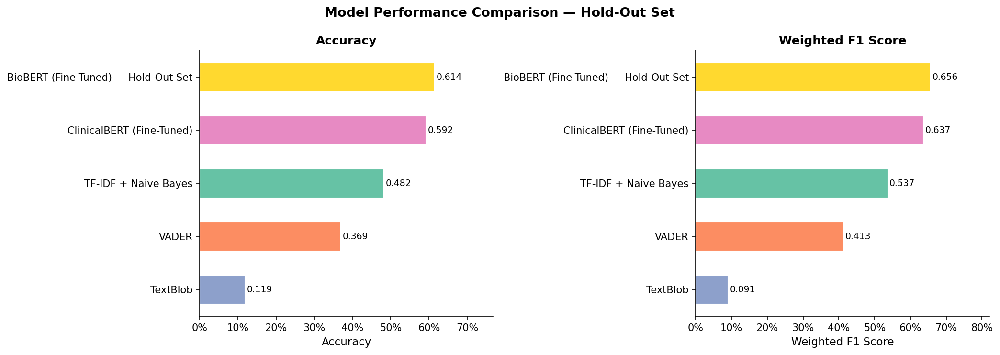
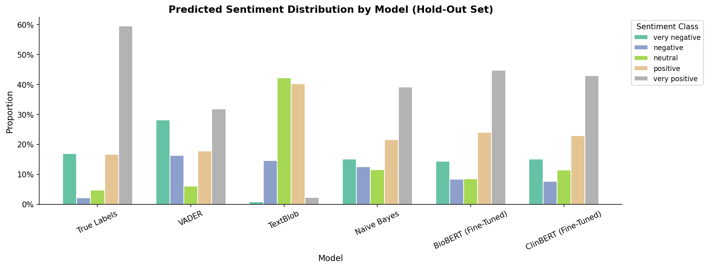
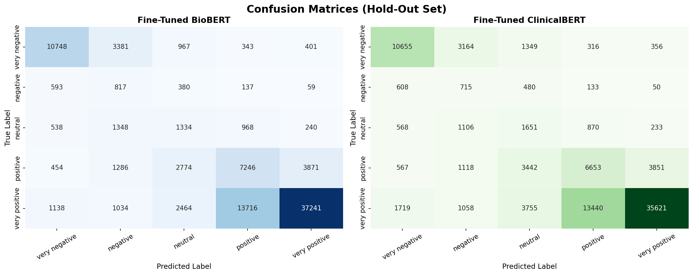

# Drug Review Sentiment Analysis

A comparative study evaluating domain-specific transformer models (BioBERT, ClinicalBERT) against traditional sentiment analysis approaches (VADER, TextBlob, Naive Bayes) on patient-written drug reviews.

## Methodology

### Dataset
- **Source**: [UCI ML Drug Review Dataset](https://archive.ics.uci.edu/ml/datasets/Drug+Review+Dataset+%28Drugs.com%29)
- **Training Set**: 35,000 samples, perfectly balanced (7,000 per class) to prevent majority-class bias during fine-tuning.
- **Hold-out Set**: The remaining reviews evaluated in their natural distribution.

### Models
1. **BioBERT**: `dmis-lab/biobert-base-cased-v1.2`
2. **ClinicalBERT**: `emilyalsentzer/Bio_ClinicalBERT`
3. **Naive Bayes**: MultinomialNB trained on 10,000 TF-IDF features.
4. **VADER & TextBlob**: Rule-based polarity thresholding.

Both transformer models were fine-tuned for 3 epochs using an effective batch size of 32, with cosine learning rate warmup and early stopping based on validation F1 score.

## Results

Models were evaluated on a hold-out set of ~93,000 patient reviews from the UCI Drug Review Dataset. The original 10-point user ratings were mapped into 5 discrete sentiment classes. 

| Model | Accuracy | Weighted F1 |
|-------|----------|-------------|
| **BioBERT (Fine-Tuned)** | **61.39%** | **0.6565** |
| ClinicalBERT (Fine-Tuned)| 59.15% | 0.6370 |
| TF-IDF + Naive Bayes | 48.18% | 0.5367 |
| VADER | 36.87% | 0.4133 |
| TextBlob | 11.93% | 0.0909 |
 

*Performance comparison demonstrating the significant advantage of fine-tuned domain-specific transformers over classical approaches.*

## Key Findings

### Lexicon vs. Transformers
General-purpose lexicon models (VADER, TextBlob) struggled with the domain vocabulary. Clinical terms often carry negative connotations in general English dictionaries (e.g., "disease", "pain"), leading to misclassifications when patients report symptom relief.
 

*Prediction distributions show lexicons skewing heavily towards negative or neutral (misinterpreting clinical terms). Transformer predictions closely mirror the true distribution.*

### BioBERT vs. ClinicalBERT
BioBERT (pre-trained on PubMed abstracts) outperformed ClinicalBERT (pre-trained on MIMIC-III clinical notes). The broader vocabulary scale of the PubMed pre-training corpus proved more effective for this dataset than the stylistic alignment of clinical doctor's notes.
 

*Confusion matrices for both models show expected adjacent-class errors (e.g., confusing "positive" with "very positive"). BioBERT exhibits slightly stronger diagonal dominance.*

## Repository Structure

- `notebooks/drug-sentiment-transformers.ipynb`: The end-to-end notebook containing the entire analysis.

- `metrics_summary.json`: Final evaluation metrics output.

## Usage

1. Import `notebooks/drug-sentiment-transformers.ipynb` into a Kaggle environment.
2. Attach the `kuc-hackathon-winter-2018` dataset to the session.
3. Enable a GPU accelerator (e.g., Tesla P100, T4).
4. Execute all cells sequentially. Output artifacts will be saved to the `/kaggle/working/` directory.
